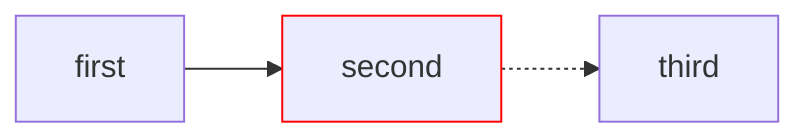

<!-- #TODO: Repository-and-File-Structure describes the OLD section names and layout update for the new structure also the links are broken -->

## Table of contents

{: toc}

## Editing the Repository

At its core, this repository uses Markdown, a mark-up language for documentation. This guide assumes *some* knowledge of Markdown. If you are unfamiliar, use this [Markdown guide](https://www.markdownguide.org/) as a reference.

Additionally, this repo uses [just-the-docs](https://just-the-docs.com) as a template for GitHub Pages. This guide will highlight some useful features. For a more in-depth look, view their [documentation](https://just-the-docs.com/#getting-started).

Follow the Table of Contents to know the basics of how this repository is structured and how to properly edit it.

## Repository and File Structure

For this guide, it will be helpful to have the repository open as you read. There's a lot going on in this repository, so let's break it down.

### The docs Folder

This is the main part of this repo, and where you will likely be spending the most time in. Within the docs folder, there's a specific structure just-the-docs uses:

Each Section of this website has a folder associated with it in the repository, such as "Administrative" or "Curriculum". Within each of those folders, there are Markdown files. The `index.md` file is the main documentation and will create an entry in the Sidebar. Other files inside the folder will be treated as "children" of the Sidebar entry, and rendered **underneath** it.<!-- #TODO: mentions an old section name that no longer exists -->

### The attachments Folder

The attachments folder is used to store any image or other files (zips, etc.) that is linked to a piece of documentation.

### Other configuration files

There are other files used for just-the-docs configuration. These files should generally be untouched unless asked to edit, as it can break the website if set up incorrectly.

The `_config.yml` file is the main just-the-docs config, specifying the website's name and description, as well as links and sidenotes. For more information, refer to the just-the-docs [documentation](https://just-the-docs.com/docs/configuration/).

### File Structure

While our documentation uses plain Markdown, there is a specific structure to follow when making a new file.

#### YAML Header

Just-the-docs requires a special header to configure the Sidebar and render pages. The YAML header is as follows:

```yaml
---
title: My Awesome Documentation
parent: Administrative
nav_order: 4
---
```

In this example, the name of the page is "My Awesome Documentation", defined by the `title` tag. This is the name that shows up on the Sidebar.

Then, it is a part of the "Administrative" page, as marked by the `parent`.

Lastly, it has a `nav_order` of 4. This means it will be the 4th entry under the parent "Administrative" page.

All pages will need a `title`. A `parent` or `nav_order` is optional, but there for organizational purposes.

Any page with children will render a Table of Contents on the parent page.<!-- #TODO: refers to an auto-generated Table of Contents / old child pages; verify it still applies -->

It is important to note that the folder name and structure is separate from the YAML header. Folder structure is there just for repository organization. The website will **only** use the YAML header to decide where to render pages and what the names will be.

This also means that you will **need** to add the YAML header to a Markdown file for the website to render it. Similarly, a page will render at the root of the Sidebar unless a `parent` tag is set.

For additional information, refer to the just-for-docs [documentation](https://just-the-docs.com/docs/navigation/).

#### Headings and Subheadings

After the YAML header, you will want to introduce the documentation topic. Here our convention is to use a subheading to start, then describe what the file's purpose is:

```markdown
## My Awesome Heading

This guide serves to provide an example of how our documentation works.
```

Feel free to change this wording to your liking.

Then you can write the rest of the file using plain Markdown.

#### Author Tag

At the end of all documents (excluding `index.md` files), we require the use of an Author Tag. This is a signature of sorts. We want you to be able to go into industry and point to anything you wrote in any lunabotics repository and say that you made it.

An example Author Tag is below:

```markdown
> Author: Firstname Lastname <https://github.com/your-username>.
```

All together, a new file should look something like the following:

```markdown
---
title: My Awesome Documentation
parent: Administrative
nav_order: 4
---

## My Awesome Documentation

This guide serves to provide an example of how our documentation works.

### First Subsection

This is a subsection.

#### First Sub-subsection

This is a sub-subsection.

### Second Subsection

This is *another* subsection.

> Author: Firstname Lastname <https://github.com/my-username>.

```

## Just-the-Docs Features

Using just-the-docs, there are a few convenience features commonly used.

### Callouts

Callouts are side notes that will render differently. For example, the following is a callout:

{: .note}
This is an example callout.

To use a callout in your documentation, use the following syntax:

```markdown
{: .note}
This is an example callout.
```

Callouts are defined in the `_config.yml` file. Currently, the supported callouts are:

- highlight
- important
- new
- note
- warning

To use another callout, simply replace the `.note` for another callout. Example:

```markdown
{: .important}
Super important text
```

renders as such:

{: .important}
Super important text.

Each of these callouts use a different color, also defined in the `_config.yml` file. For more information, refer to the just-the-docs [documentation](https://just-the-docs.com/docs/ui-components/callouts/).

### Linking Media

It is common to need to hyperlink a website, attachment, or another piece of documentation.

#### Hyperlinking a Website

For a basic hyperlink, follow the default Markdown syntax:

```markdown
[Text](https://google.com)
```

This renders the following: [Text](https://google.com). The text in brackets is what is rendered on the website.

#### Hyperlinking Documentation

Sometimes you may want to link another piece of our documentation With just-the-docs, there is a bit of a different way to link a piece of documentation. Use the following syntax:



```markdown
[Administrative]()
```



This renders the following: [Administrative]()

#### Attaching an Image

To attach an image, it is similar syntax to hyperlinking a piece of documentation:



```markdown

```



This renders the following:


Be sure to set the Alt Text in brackets as it helps accessibility for screen readers.

### Mermaid Diagrams

This website has Mermaid support enabled, which allows you to create diagrams directly within the documentation using simple code blocks. If you have never used Mermaid before, I recommend looking at the Diagram Syntax section of the [Official Documentation](https://mermaid.ai/open-source/intro/syntax-reference.html). Unless you plan on creating really advanced diagrams, you probably only need to go over the syntax structure and the basic syntax for the different types of diagrams.

To make a diagram render in the documentation, you write out the code inside a code block, just like how you would if you were writing out example code for documentation. Just-the-Docs will see that code and know to render it as a diagram instead of a block of code.

For example, if I want to render a left $\rightarrow$ right flowchart, I would type something like this in the markdown file:

````text

````

When you look through the website, that code will display like this:


If you toggle your theme at the top of the webpage, you can see that the diagrams will automatically adapt to the theme to keep them readable. You can still customize the color of elements, however.

You'll probably notice that the diagram always renders left-justified. If you want the diagram centered, you need to add the `{.text-center}` attribute to the bottom, which tells Just-the-Docs to center the item:

````text
<!-- markdownlint-disable MD031 -->

{: .text-center }
<!-- markdownlint-enable MD031 -->
````

{: .important}
We have to disable the linter rule `MD031` specifically when centering Mermaid diagrams, because the `{.text-center}` attribute must be placed directly under the closing ticks of the code block, which triggers this linter warning.

Adding this attribute will make the diagram render center-justified:

<!-- markdownlint-disable MD031 -->

{: .text-center }
<!-- markdownlint-enable MD031 -->

{: .note}
You can use the `{.text-center}` attribute, as well as any other attributes on anything inside your documentation, including images, text, and code blocks.

This is just a basic overview of how to include Mermaid diagrams in your documentation. It is strongly recommended that you do more research in order to fully take advantage of their capabilities.

Once you understand commonly used features, learn how to [locally test this repository](#Testing Locally).

> Author: Aiden Kimmerling (<https://github.com/TheKing349>)  
> Author: Jesse Mills (<https://github.com/JesseMills0>)
