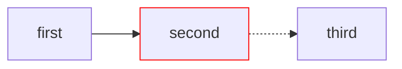

## Just-the-Docs Features

Using just-the-docs, there are a few convenience features commonly used.

### Callouts

Callouts are side notes that will render differently. For example, the following is a callout:

{: .note}
This is an example callout.

To use a callout in your documentation, use the following syntax:

```markdown
{: .note}
This is an example callout.
```

Callouts are defined in the `_config.yml` file. Currently, the supported callouts are:

- highlight
- important
- new
- note
- warning

To use another callout, simply replace the `.note` for another callout. Example:

```markdown
{: .important}
Super important text
```

renders as such:

{: .important}
Super important text.

Each of these callouts use a different color, also defined in the `_config.yml` file. For more information, refer to the just-the-docs [documentation](https://just-the-docs.com/docs/ui-components/callouts/).

### Linking Media

It is common to need to hyperlink a website, attachment, or another piece of documentation.

#### Hyperlinking a Website

For a basic hyperlink, follow the default Markdown syntax:

```markdown
[Text](https://google.com)
```

This renders the following: [Text](https://google.com). The text in brackets is what is rendered on the website.

#### Hyperlinking Documentation

Sometimes you may want to link another piece of our documentation With just-the-docs, there is a bit of a different way to link a piece of documentation. Use the following syntax:



```markdown
[Administrative]()
```



This renders the following: [Administrative]()

#### Attaching an Image

To attach an image, it is similar syntax to hyperlinking a piece of documentation:



```markdown

```



This renders the following:


Be sure to set the Alt Text in brackets as it helps accessibility for screen readers.

### Mermaid Diagrams

This website has Mermaid support enabled, which allows you to create diagrams directly within the documentation using simple code blocks. If you have never used Mermaid before, I recommend looking at the Diagram Syntax section of the [Official Documentation](https://mermaid.ai/open-source/intro/syntax-reference.html). Unless you plan on creating really advanced diagrams, you probably only need to go over the syntax structure and the basic syntax for the different types of diagrams.

To make a diagram render in the documentation, you write out the code inside a code block, just like how you would if you were writing out example code for documentation. Just-the-Docs will see that code and know to render it as a diagram instead of a block of code.

For example, if I want to render a left $\rightarrow$ right flowchart, I would type something like this in the markdown file:

````text

````

When you look through the website, that code will display like this:


If you toggle your theme at the top of the webpage, you can see that the diagrams will automatically adapt to the theme to keep them readable. You can still customize the color of elements, however.

You'll probably notice that the diagram always renders left-justified. If you want the diagram centered, you need to add the `{.text-center}` attribute to the bottom, which tells Just-the-Docs to center the item:

````text
<!-- markdownlint-disable MD031 -->

{: .text-center }
<!-- markdownlint-enable MD031 -->
````

{: .important}
We have to disable the linter rule `MD031` specifically when centering Mermaid diagrams, because the `{.text-center}` attribute must be placed directly under the closing ticks of the code block, which triggers this linter warning.

Adding this attribute will make the diagram render center-justified:

<!-- markdownlint-disable MD031 -->

{: .text-center }
<!-- markdownlint-enable MD031 -->

{: .note}
You can use the `{.text-center}` attribute, as well as any other attributes on anything inside your documentation, including images, text, and code blocks.

This is just a basic overview of how to include Mermaid diagrams in your documentation. It is strongly reccomended that you do more research in order to fully take advantage of their capabilities.

Once you understand commonly used features, learn how to [locally test this repository]().

> Author: Aiden Kimmerling <https://github.com/TheKing349>  
> Author: Jesse Mills <https://github.com/JesseMills0>