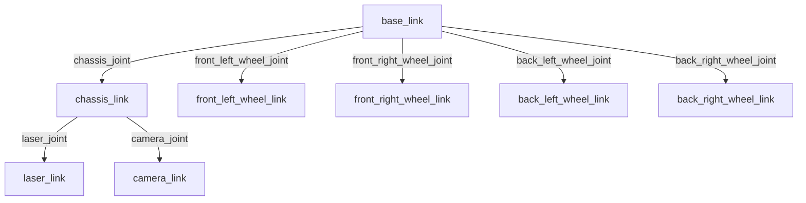
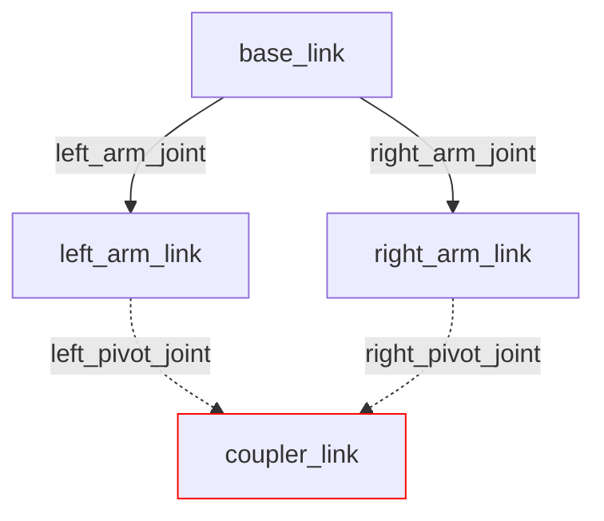

## Understanding URDF Files

Unified Robot Description Format (URDF) is the standard for representing a robot in ROS2. It serves as a machine-readable blueprint that allows ROS2 programs to "visualize" your robot in order to carry out its various tasks, such as control, sensing, and autonomy.

The purpose of this guide is to help you understand what a URDF represents, how they work, and how to get started with creating a basic URDF of a robot from scratch. As part of this process, this guide will spend a lot of time going over individual URDF tags and what they are used to represent. For a more detailed look at URDF standards and features, as well as guides on URDF integration for different libraries and softwares that work alongside ROS2, see our technical [URDF documentation](). Note that this documentation was written for ROS2 Jazzy, so if you are using a different version, there may be differences in structure.

The robot model you will construct in this guide is heavily based on a [video tutorial](https://www.youtube.com/watch?v=BcjHyhV0kIs&t=1292s) made by [Articulated Robotics](https://www.youtube.com/@ArticulatedRobotics) in 2022. Their written guide, [Describing Robots with URDF](https://articulatedrobotics.xyz/tutorials/ready-for-ros/urdf/), was also a huge help when researching for this tutorial. While these are fantastic guides and I strongly recommend looking at them, they are a little outdated due to their age. This guide will use a very similar model to the 2022 video, with some tweaks to the overall design to make it a little more relevant to what we work on in Lunabotics, as well as bringing it in line with ROS2 Jazzy standards, as a few things have changed in the newer versions of ROS2 that can influence how your URDF is structured.

By the end of this guide, you should have a basic model of a robot in URDF format. If you visualize your URDF, either using a VSCode extension, running your ROS2 package with a launch file, or some other means, you should get a 3D model that looks something like this:

{: width="49%" }
{: width="49%" style="margin-left:1%;" }

> Note: I am using Foxglove Studio to render the URDF for this tutorial, if you are using something else, your model may look slightly different, but it should maintain the same core shapes.

## What is a URDF?

As previously stated, URDF, which stands for Unified Robot Description Format, is the standard for representing a robot's physical model through a ROS2 topic. When you launch your ROS2 package, the `/robot_description` topic publishes the information from your URDF and can be subscribed to and rendered by a visualizer like Rviz, Foxglove, or Rerun. These files effectively specify the size and shape of the robot, which is very helpful when it comes to things like remote navigation and autonomy.  

The URDF file is also used to specify the location of any cameras and sensors on the robot, which is a critical requirement for localization. If the robot does not know where sensor data is coming from relative to itself, it cannot use that data to orient itself or navigate autonomously.

## Structure of a URDF

URDF files are effectively highly specialized XML files. They define a series of elements that go on to define components of your robot, with each individual element defining a different "part" of the robot (i.e. wheels, chassis, a robotic arm, cameras, sensors, etc.). Each element has its own configurations, and its own specified placement in the final model. Each of these elements come together when ROS2 builds your URDF to define a complete model of your robot, either for the purposes of simulation in software such as Gazebo or MuJoCo, or for use in managing an actual robot.

All components of your robot specified in your URDF must follow a parent-child relationship. Basically, when you define a new element in your URDF, you need to specify what other part of the robot you "attach" it to. The URDF also treats the parent of a component as the origin for that component, so if you need to calculate coordinate displacement of a component, it needs to be done with reference to the component's parent. The only element in your URDF that is not a child of another component is the `base_link`. This is because the `base_link` is defined with the express purpose as acting as the parent to all other components in the URDF.

If you are struggling to visualize this concept, try thinking of it like a tree. The root of the tree is `base_link`, and every other link inside the URDF branches off of `base_link`, with all of the links being held together by joints. The next section will go over links and joints in more detail.



> This is a tree diagram representation of the robot we will be modeling later on. Keep in mind that this is a very simple model; URDFs of real robots will very likely be much more complicated than this, but they should maintain the same basic structure.

The tree visualization also helps clarify one of the most important (and limiting) rules about URDF: While a parent can have as many children as necessary, a child can only have **one parent**. This makes any closed loop system, such as a four-bar linkage or tank treads, impossible to accurately simulate with a URDF.

<!-- markdownlint-disable MD031 -->

{: .text-center }
<!-- markdownlint-enable MD031 -->

> This tree visualization of a four-point linkage shows how it's not possible for one child (`coupler_link`), to have multiple parents (`left_pivot_joint` and `right_pivot_joint`). Think of how, on a real tree, the trunk will split off into many smaller branches, but those branches will never recombine.

## Links and Joints

In the last two diagrams, you saw a lot of references to elements named `something_link` and `something_joint`. The  `<link>` and `<joint>` tags are probably the two most important tags in URDF files, as they are what you actually use to define a component of your robot. Typically, they are used in pairs, (except `base_link`, which doesn't have a joint counterpart) with the `<link>` defining the visual structure and physical properties of the part, and the `<joint>` defining how two links are connected. We usually split up the various parts of our robot into many link/joint pairs.
  
### Links

The `<link>` tag is used to describe anything with inertia, visual features, and/or collision properties. In more human terms, links represent any physical component of the robot. Three properties are defined inside the link tag, and each of them are broken up into their own sub-properties:

- `<visual>`: This defines what the visualizer will show you when it renders this link. Inside `<visual>`, you can define:
  - `<geometry>`: This is the shape of the link. It can be a generic shape (`box`, `cylinder`, or `sphere` with size parameters), or it can be a `mesh`. If you use the `mesh` type, you have to link an associated 3d model file. Most geometry formats will at least render the visual shape, but additional compatibility (like textures) will vary between formats.
  - `<origin>`: Works the same as the joint origin, only it applies to the geometry, so can offset the center from the link origin.
  - `<material>`: This tag was explained earlier when we talked about `colors.xacro`. This is where those colors will be used in the URDF.
- `<collision>`: This defines the "hitbox" of the link, and is especially important when doing physics simulation. Inside the collision tag, you can define the geometry and the origin, just as you would for the visual tag. In fact, you can usually just copy and paste the visual properties into `<collision>`, excluding `<material>`, though this might cause some issues if you are using meshes for your visualization. If this is the case, consider replacing the collision with a similar looking basic shape.

- `<inertial>`: Defines the [rotational inertia matrix](https://en.wikipedia.org/wiki/Moment_of_inertia#Inertia_tensor), which describes how the distribution of mass affects rotation. This can be very confusing, so for the sake of this tutorial, we will be using a premade file with all the inertial tags we might need already defined. If you want to give it a try, though, you can look at this [list of matrices for common shapes](https://en.wikipedia.org/wiki/List_of_moments_of_inertia#List_of_3D_inertia_tensors). You can probably get a good estimate by approximating your links as simpler shapes. As for the actual inertial tag, there are three things you will need to specify:  
  - `<origin>`: Defines the center of mass of the link, works the same way as the other origin tags.
  - `<mass>`: Simply represents the mass of the link.
  - `<inertia>`: Not to be confused with the enclosing `<inertial>` tag, `<inertia>` defines the moment of inertia of the link.
  
  If you want to get a better idea of how the inertial properties are defined, look at the contents of the `inertial_macros.xacro` file linked later in this tutorial.

### Joints

As stated previously, the `<joint>` is used to define the type of connection between two links. In other words, it tells the system how the different parts of the robot are allowed to move. There are four common kinds of joints:

- `revolute`: Rotational motion with a minimum and maximum angle limit.
- `continuous`: Rotational motion with no limits (think of a wheel).
- `prismatic`: Linear side-to-side motion, with a minimum and maximum angle limit.
- `fixed`: Completely rigid connection, no motion is permitted.


> Image & Definitions sourced from [Articulated Robotics](https://articulatedrobotics.xyz/tutorials/ready-for-ros/urdf)

When we build our robot model, we will only be using `fixed` and `continuous` joints in our URDF. It's also worth noting that two other kinds of joints exist: `planar` and `floating`, but you will rarely (if ever) see these in use. To learn more, visit the [ROS Documentation](https://wiki.ros.org/urdf/XML/joint) (while this website is for ROS 1, the URDF information should still be mostly accurate).

It's also important to note that the joint is usually where the parent-child relationship and the offset of an object is defined. The parent-child relationship is defined using the `<parent>` and `<child>` tags, and the offset relative to the parent is determined using the `<origin>` tag. The origin tag uses `xyz` values for linear offset (in meters) and `rpy` values for rotational offset (in radians). 

## Building your URDF

Before we start, its important to note that while you can place all of your components into one large URDF file, this is generally not good practice, as they can get very large and difficult to manage relatively quickly. Instead, its a good idea to use Xacro (XML Macros) to split your URDF into multiple smaller files that can be compiled together using special tags. For a detailed look at how to integrate xacro into your URDF, see [URDF with Xacro Templates](). For an extensive look at the additional features xacro provides, see [URDF with Xacro Features]().

To get started with actually constructing your URDF, the first step is choosing a name for your robot. This name *must* be listed in the "main" URDF file. You can place it in our other files as well, but it is not necessary. For this tutorial, I named this robot "Tootles". The name is completely arbitrary. It doesn't matter what you choose, but you will want to keep it in mind for organizational purposes.  

Now, to actually get started constructing the robot model, I like to first create the xacro files I will need, so that I can build the main URDF xacro. Every robot following this convention will have at least two xacro files. The first, `robotName.urdf.xacro` (replace `robotName` with the name you chose for your robot), will effectively serve as the location where you combine all of your xacro files together using `include` tags. This is also where you will define your robot's name and the `base_link`. The second file, `robotName_core.xacro`, is where you will define the core body of your robot. For our purposes, this will just consist of the robot's chassis, and the wheels, but for more complex robots, this file can easily grow quite large. If this is the case, you can further break up your core file into smaller xacro files, but this will not be necessary for this tutorial.  

Optionally, you can also include xacro files for various other aspects of your robot, or anything inside your ROS2 package that requires URDF components to function. If you want to simulate your robot in Gazebo, you will need to include SDF references in your URDF (see [Gazebo in URDF]()). If you want to integrate ros2_control into your robot, either for simulation or actual control, you will need URDF components for each of the joints you want to send or receive information from (see [ROS2 Control in URDF]()). Both of these should generally be done in their own xacro file, named `gazebo.xacro` and `ros2_control.xacro` respectively. For this project, I will be including two additional files. The first, called `colors.xacro` simply contains a few colors I can assign to different parts of the robot. Feel free to copy these or [download]() the file for use in your own design, as I won't spend too much time going over them.  

```xml
<?xml version="1.0" encoding="utf-8"?>
<robot xmlns:xacro="http://www.ros.org/wiki/xacro">

  <!-- Colors for making different parts easier to identify -->
  <material name="red">
    <color rgba="1 0 0 1"/>
  </material>

  <material name="blue">
    <color rgba="0 0 1 1"/>
  </material>

  <material name="gray">
    <color rgba="0.6 0.6 0.6 1"/>
  </material>

  <material name="orange">
    <color rgba="1 0.5 0 1"/>
  </material>

</robot>
```

The `material` tag contains information about how a visualization software should make any given object look. The only tag within `material` you will have to worry about most of the time is `color`. The `color` tag takes in one string of four numbers, each within the range of 0 to 1. These numbers represent an RGBA value (Red, Green, Blue, Alpha). Alpha describes the transparency of the color.

The second additional file I'm including is a little more complicated, so I strongly suggest you just [download]() it if you are following this tutorial. This file, called `inertial_macros.xacro` basically contains a bunch of pre-made inertia values that will be necessary to include if you want to simulate this bot in something like Gazebo. While simulation is outside the scope of this tutorial, I will be showing you how to include inertial data in your link elements. You don't need to make a seperate file for this, but inertia can be confusing if you aren't familliar with the physics behind it, and you generally shouldn't ever need to do your own inertia calcualtaions when making a URDF, so  having a bunch of pre-defined options is helpful. Credit for this file goes to [Josh Newans](https://github.com/joshnewans/articubot_one/blob/main/description/inertial_macros.xacro) of Articulated Robotics.

Okay, now that we have made all of the files we will need, we can get started by building our main URDF file. These first couple of steps are also documented in [URDF with Xacro Templates](#in-file-structure), but for the sake of simplicity I will explain these concepts again here. The first thing you need to do in every single xacro file is define the XML version and the UTF encoding you will be using. For URDF, you will always use XML Version 1.0 and UTF-8 encodings. Therefore, the first line on every single xacro you make should be:

```xml
<?xml version="1.0" encoding="utf-8"?>
```

Next, you need to declare the `robot` tag and import xacro, so that your system will recognize that we are using xacro syntax. The `robot` tag will contain *everything* else you write in the URDF. All of your xacro files need to have an enclosing `robot` tag. Remember, your main `robotName.urdf.xacro` file *must* declare the name of the robot. The rest of your xacro files will still need the `robot` tag and xacro import, but the inclusion of the name is completely optional.  

```xml
<robot name="Tootles" xmlns:xacro="http://www.ros.org/wiki/xacro">
    <!-- This is where the rest of your tags will be located -->
</robot>
```  

Now, with our basic structure in place, we will want to add the `include` tags that will allow our main URDF file to see everything. This is a fairly simple process. For each additional xacro file in the directory storing your xacro files, you will want to add a new line like this:

```xml
<!-- Replace "file_name.xacro" with whatever file you want to include. -->
<xacro:include filename="file_name.xacro"/>
```  

Remember that in order for xacro to parse all of the files, they need to be placed in the same directory. Typically this is something like `ros2/package/description/urdf` inside your ROS2 package. Once you have included all of your xacro files, you will now want to declare your `base_link`. Because `base_link` simply serves as the "origin" of the robot and the point from which all other components are attached, it doesn't actually need any additional properties. Once you have all of the contents of your main URDF constructed, you should have something like this.  

```xml
<?xml version="1.0" encoding="utf-8"?>
<!-- You can name your robot whatever you like, but it *must* have a name! -->
<robot name="Tootles" xmlns:xacro="http://www.ros.org/wiki/xacro"> 

  <xacro:include filename="colors.xacro"/>
  <xacro:include filename="inertial_macros.xacro"/>
  <xacro:include filename="tootles_core.xacro"/>

  <link name="base_link"></link>

</robot>
```  

This is the only full file structure I am going to show throughout this tutorial since, as previously stated, these files can get rather large fairly quickly. For the rest of this guide, I will only show complete blocks of certain components, since it doesn't really matter what order they go in inside the file, as long as the parent element is declared before the child.  

Now that we have set up the main URDF file, we will move on to defining the actual visual structure of the robot. Open up your "core" xacro file (for me its `tootles_core.xacro`), add the XML and encoding versions, and declare your `robot` tag. These first steps should look identical to the first couple steps in your main URDF file, with the exception of the name declaration not being necessary.  

Now it is time to write the links and joints that will make up our robot. Generally speaking, it is a good idea to create a link-joint pair for the following situations:

- Any parts of your robot that move in relation to another part, such as segments of a robotic arm or wheels  
- Anywhere on the robot where it might be convenient to have a reference point for later use, like the location of a camera or LiDAR.

