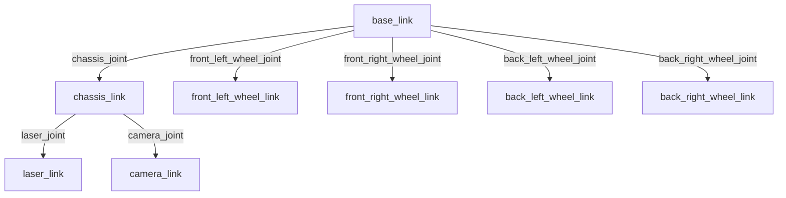
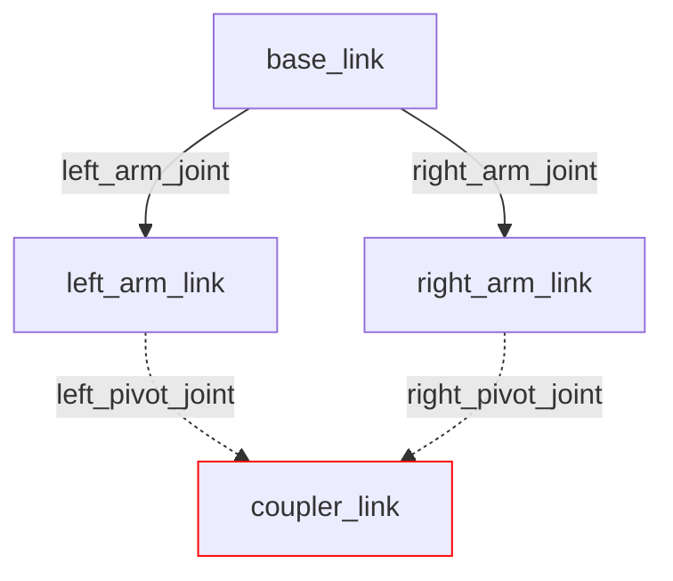

## Understanding URDF Files

Unified Robot Description Format (URDF) is the standard for representing a robot in ROS2. It serves as a machine-readable blueprint that allows ROS2 programs to "visualize" your robot in order to carry out its various tasks, such as control, sensing, and autonomy.

The purpose of this guide is to help you understand what a URDF represents, how they work, and how to get started with creating a basic URDF of a robot from scratch. As part of this process, this guide will spend a lot of time going over individual URDF tags and what they are used to represent. For a more detailed look at URDF standards and features, as well as guides on URDF integration for different libraries and softwares that work alongside ROS2, see our technical [URDF documentation](). Note that this documentation was written for ROS2 Jazzy, so if you are using a different version, there may be differences in structure.

The robot model you will construct in this guide is heavily based on a [video tutorial](https://www.youtube.com/watch?v=BcjHyhV0kIs&tz) made by [Articulated Robotics](https://www.youtube.com/@ArticulatedRobotics) in 2022. Their written guide, [Describing Robots with URDF](https://articulatedrobotics.xyz/tutorials/ready-for-ros/urdf/), was also a huge help when researching for this tutorial. While these are fantastic guides and I strongly recommend looking at them, they are a little outdated due to their age. This guide will use a very similar model to the 2022 video, with only some minor tweaks.

By the end of this guide, you should have a basic model of a robot in URDF format. If you visualize your URDF, either using a VSCode extension, running your ROS2 package with a launch file, or some other means, you should get a 3D model that looks something like this:

{: width="49%" }
{: width="49%" style="margin-left:1%;" }

{: .note}
I am using Foxglove Studio to render the URDF for this tutorial, if you are using something else, your model may look slightly different, but the overall shape should be the same.

## What is a URDF?

To reiterate, URDF, which stands for Unified Robot Description Format, is the standard for representing a robot's physical model through a ROS2 topic. When you launch your ROS2 package, the `/robot_description` topic publishes the information from your URDF and can be subscribed to and rendered by a visualizer like Rviz, Foxglove, or Rerun. These files effectively specify the size and shape of the robot, which is very helpful when it comes to things like remote navigation and autonomy.  

The URDF file is also used to specify the location of any cameras and sensors on the robot, which is a critical requirement for localization. If the robot does not know where sensor data is coming from relative to itself, it cannot use that data to orient itself or navigate autonomously.

## Structure of a URDF

URDF files are effectively highly specialized XML files. They define a series of elements that go on to define components of your robot, with each individual element defining a different "part" of the robot (i.e. wheels, chassis, a robotic arm, cameras, sensors, etc.). Each element has its own configurations, and its own specified placement in the final model. Each of these elements come together when ROS2 builds your URDF to define a complete model of your robot, either for the purposes of simulation in software such as Gazebo or MuJoCo, or for use in managing an actual robot.

All components of your robot specified in your URDF must follow a parent-child relationship. Basically, when you define a new element in your URDF, you need to specify what other part of the robot you "attach" it to. The URDF also treats the parent of a component as the origin for that component, so if you need to calculate coordinate displacement of a component, it needs to be done with reference to the component's parent. The only element in your URDF that is not a child of another component is the `base_link`. This is because the `base_link` is defined with the express purpose as acting as the parent to all other components in the URDF.

If you are struggling to visualize this concept, try thinking of it like a tree. The root of the tree is `base_link`, and every other link inside the URDF branches off of `base_link`, with all of the links being held together by joints. The next section will go over links and joints in more detail.



> This is a tree diagram representation of the robot we will be modeling later on. Keep in mind that this is a very simple model; URDFs of real robots will very likely be much more complicated than this, but they should maintain the same basic structure.

The tree visualization also helps clarify one of the most important (and limiting) rules about URDF: While a parent can have as many children as necessary, a child can only have **one parent**. This makes any closed loop system, such as a four-bar linkage or tank treads, impossible to accurately simulate with a URDF.

<!-- markdownlint-disable MD031 -->

{: .text-center }
<!-- markdownlint-enable MD031 -->

> This tree visualization of a four-point linkage shows how it's not possible for one child (`coupler_link`), to have multiple parents (`left_pivot_joint` and `right_pivot_joint`). Think of how, on a real tree, the trunk will split off into many smaller branches, but those branches will never recombine.

## Links and Joints

In the last two diagrams, you saw a lot of references to elements named `something_link` and `something_joint`. The  `<link>` and `<joint>` tags are probably the two most important tags in URDF files, as they are what you actually use to define a component of your robot. Typically, they are used in pairs, (except `base_link`, which doesn't have a joint counterpart) with the `<link>` defining the visual structure and physical properties of the part, and the `<joint>` defining how two links are connected. We usually split up the various parts of our robot into many link/joint pairs.
  
### Links

The `<link>` tag is used to describe anything with inertia, visual features, and/or collision properties. In more human terms, links represent any physical component of the robot. Three properties are defined inside the link tag, and each of them are broken up into their own sub-properties:

- `<visual>`: This defines what the visualizer will show you when it renders this link. Inside `<visual>`, you can define:
  - `<geometry>`: This is the shape of the link. It can be a generic shape (`box`, `cylinder`, or `sphere` with size parameters), or it can be a `mesh`. If you use the `mesh` type, you have to link an associated 3d model file. Most geometry formats will at least render the visual shape, but additional compatibility (like textures) will vary between formats.
  - `<origin>`: Works the same as the joint origin, only it applies to the geometry, allowing you to offset the center of the visualized shape from the link origin.
  - `<material>`: Contains information about how a visualization software should make any given object look. Most often used to alter the color.
- `<collision>`: This defines the "hitbox" of the link, and is especially important when doing physics simulation or any kind of autonomous navigation. Inside the collision tag, you define the geometry and the origin, just as you would for the visual tag. In fact, you can usually just copy and paste the visual properties into `<collision>`, excluding `<material>`, though this might cause some issues if you are using meshes for your visualization. If this is the case, consider replacing the collision with a similar looking basic shape.

- `<inertial>`: Defines the [rotational inertia matrix](https://en.wikipedia.org/wiki/Moment_of_inertia#Inertia_tensor), which describes how the distribution of mass affects rotation. This can be very confusing, so for the sake of this tutorial, we will be using a premade file with all the inertial tags we might need already defined. If you want to give it a try, though, you can look at this [list of matrices for common shapes](https://en.wikipedia.org/wiki/List_of_moments_of_inertia#List_of_3D_inertia_tensors). You can probably get a good estimate by approximating your links as simpler shapes. As for the actual inertial tag, there are three things you will need to specify:  
  - `<origin>`: Defines the center of mass of the link, works the same way as the other origin tags.
  - `<mass>`: Simply represents the mass of the link.
  - `<inertia>`: Not to be confused with the enclosing `<inertial>` tag, `<inertia>` defines the moment of inertia of the link.
  
  If you want to get a better idea of how the inertial properties are defined, look at the contents of the `inertial_macros.xacro` file linked later in this tutorial.

### Joints

As stated previously, the `<joint>` is used to define the type of connection between two links. In other words, it tells the system how the different parts of the robot are allowed to move. There are four common kinds of joints:

- `revolute`: Rotational motion along an axis, with a minimum and maximum angle limit.
- `continuous`: Rotational motion with no limits (think of a wheel).
- `prismatic`: Linear motion along an axis, with a minimum and maximum position limit.
- `fixed`: Completely rigid connection, no motion is permitted.


{: style="text-align: center;" }
*Image & Definitions sourced from [Articulated Robotics](https://articulatedrobotics.xyz/tutorials/ready-for-ros/urdf)*

When we build our robot model, we will only be using `fixed` and `continuous` joints in our URDF. It's also worth noting that two other kinds of joints exist: `planar` and `floating`, but you will rarely (if ever) see these in use. To learn more, visit the [ROS Documentation](https://wiki.ros.org/urdf/XML/joint) (while this website is for ROS 1, the URDF information should still be mostly accurate).

Every joint you define must have the following specifications:

- `type`: This is where you define which kind of joint you want the tag to represent.
- `<parent>`: The parent link in the parent-child relationship
- `<child>`: The child link in the parent-child relationship
- `<origin>`: The offset between the two links, before motion is applied.

If you are defining something other than a `fixed` joint, you may have to specify additional parameters. These can include:

- `<axis>`: The axis the joint permits movement along
- `<limit>`: Physical actuation limits, may be expected by other parts of the system. May include:
  - `upper` and `lower`: Position limits, may be taken in meters or radians, depending on the type of joint
  - `velocity`: Taken in meters per second or radians per second, depending on the type of joint
  - `effort`: Work limit, taken in Newtons or Newton-meters, depending on the type of joint

## Additional Tags

There may be occasions where you see tags other than links and joints defined within your enclosing robot tag. These may include `<gazebo>`, `<material>`, and `<transmission>` tags. We already briefly mentioned `<material>` tags, but the next section will have a little more detail. The `<gazebo>` and `<transmission>` tags far exceed the scope of this tutorial, but we (plan to) have additional information on them in other guides.

To learn more about Gazebo integration using the `<gazebo>` tag, see [Gazebo in URDF]().  
TODO: Link Transmission Tutorial (not done yet)

## Building your URDF

Before we start, it's important to note that while you can place all of your components into one large URDF file, this is generally not good practice, as they can get very large and difficult to manage relatively quickly. Instead, it's a good idea to use Xacro (XML Macros) to split your URDF into multiple smaller files that can be compiled together using special tags. For a detailed look at how to integrate xacro into your URDF, see [URDF with Xacro Templates](). For an extensive look at the additional features xacro provides, see [URDF with Xacro Features]().

To get started with actually constructing your URDF, the first step is choosing a name for your robot. This name *must* be listed in the "main" URDF file. You can place it in your other files as well, but it is not necessary. For this tutorial, I named this robot "Tootles". The name is completely arbitrary. It doesn't matter what you choose, but you will want to keep it in mind for organizational purposes.  

Now, to actually get started constructing the robot model, I like to first create the xacro files I will need, so that I can build the main URDF xacro. Every robot following this convention will have at least two xacro files. The first file, `robotName.urdf.xacro` (replace `robotName` with the name you chose for your robot), will be where you combine all of your xacro files together using `include` tags. This is also where you will define your robot's name and the `base_link`.  

The second file, `robotName_core.xacro`, is where you will define the core body of your robot. For our purposes, this will just consist of the robot's chassis, and the wheels, but for more complex robots, this file can easily grow quite large. If necessary, you can further break up your core file into smaller xacro files.  

Optionally, you can also include xacro files for various other aspects of your robot, or anything inside your ROS2 package that requires URDF components to function. If you want to simulate your robot in Gazebo, you will need to include SDF references in your URDF (see [Gazebo in URDF]()). If you want to integrate ros2_control into your robot, either for simulation or actual control, you will need URDF components for each of the joints you want to send or receive information from (see [ROS2 Control in URDF]()). For this project, I will be including two additional files. The first, called `colors.xacro` simply contains a few colors I can assign to different parts of the robot. Feel free to copy these or [download]() the file for use as you follow along.  

```xml
<?xml version="1.0" encoding="utf-8"?>
<robot xmlns:xacro="http://www.ros.org/wiki/xacro">

  <!-- Colors for making different parts easier to identify -->
  <material name="red">
    <color rgba="1 0 0 1"/>
  </material>

  <material name="blue">
    <color rgba="0 0 1 1"/>
  </material>

  <material name="gray">
    <color rgba="0.6 0.6 0.6 1"/>
  </material>

  <material name="orange">
    <color rgba="1 0.5 0 1"/>
  </material>

</robot>
```

If you think back to our list of link attributes, the `material` tag contains information about how a visualization software should make any given object look. The only tag inside `<material>` you will have to worry about most of the time is `<color>`. The `color` tag takes in one string of four numbers, each within the range of 0 to 1. These numbers represent an RGBA value (Red, Green, Blue, Alpha). Alpha describes the transparency of the color.

The second additional file I'm including is a little more complicated, so I strongly suggest you just [download]() it if you are following this tutorial. This file, called `inertial_macros.xacro` basically contains a bunch of pre-made inertia calculations that will be necessary to include if you want to simulate this bot in something like Gazebo. While simulation is outside the scope of this tutorial, I will be showing you how to include inertial data in your link elements. To use these macros, all you have to do is plug in some information and it will fill in those values for the calculations. You don't need to make a separate file for this, but inertia can be confusing if you aren't familiar with the physics behind it, and you generally shouldn't ever need to do your own inertia calculations when making a URDF, so having a bunch of pre-defined options is helpful. Credit for this file goes to [Josh Newans](https://github.com/joshnewans/articubot_one/blob/main/description/inertial_macros.xacro) of Articulated Robotics.

Okay, now that we have made all of the files we will need, we can get started by building our main URDF file (`robotName.urdf.xacro`). These first couple of steps are also documented in [URDF with Xacro Templates](#in-file-structure), but for the sake of simplicity I will explain these concepts again here. 

The first thing you need to do in every single xacro file is define the XML version and the UTF encoding you will be using. For URDF, you will always use XML Version 1.0 and UTF-8 encodings. Therefore, the first line on every single xacro you make should be:

```xml
<?xml version="1.0" encoding="utf-8"?>
```

Next, you need to declare the `robot` tag and import xacro, so that your system will recognize that we are using xacro syntax. The `robot` tag will contain *everything* else you write in the URDF. All of your xacro files need to have an enclosing `robot` tag. Remember, your main `robotName.urdf.xacro` file *must* declare the name of the robot. The rest of your xacro files will still need the `robot` tag and xacro import, but the inclusion of the name is completely optional.  

```xml
<robot name="Tootles" xmlns:xacro="http://www.ros.org/wiki/xacro">
    <!-- This is where the rest of your tags will be located -->
</robot>
```  

Now, with our basic structure in place, we will want to add the `include` tags that will allow our main URDF file to see everything. This is a fairly simple process. For each additional xacro file in the directory storing your xacro files, you will want to add a new line like this:

```xml
<!-- Replace "file_name.xacro" with whatever file you want to include. -->
<xacro:include filename="file_name.xacro"/>
```  

Remember that in order for xacro to parse all of the files, they need to be placed in the same directory. Typically this is something like `ros2/packageName/description/urdf` inside your robot directory. Once you have included all of your xacro files, you will now want to declare your `base_link`. Because `base_link` simply serves as the "origin" of the robot and the point from which all other components are attached, it doesn't actually need any additional properties. Once you have all of the contents of your main URDF constructed, you should have something like this.  

```xml
<?xml version="1.0" encoding="utf-8"?>
<!-- You can name your robot whatever you like, but it *must* have a name! -->
<robot name="Tootles" xmlns:xacro="http://www.ros.org/wiki/xacro"> 

  <xacro:include filename="colors.xacro"/>
  <xacro:include filename="inertial_macros.xacro"/>
  <xacro:include filename="tootles_core.xacro"/>

  <link name="base_link"></link>

</robot>
```  

For all links and joints, we will follow the naming convention `partName_link` and `partName_joint` respectively. This is so that it is easy to make out each link-joint pair.

Now that we have set up the main URDF file, we will move on to defining the visible parts of the robot. Open up your "core" xacro file (for me it's `tootles_core.xacro`), add the XML and encoding versions, and declare your `robot` tag. These first steps should look identical to the first couple steps in your main URDF file, with the exception of the name declaration not being necessary.  

Now we can write the links and joints that will make up our robot. Generally speaking, it is a good idea to create a link-joint pair for the following situations:

- Any parts of your robot that move in relation to another part, such as segments of a robotic arm or wheels  
- Anywhere on the robot where it might be convenient to have a reference point for later use, like the location of a camera or LiDAR.

For the robot we are building, the only moving parts in our model will be the wheels. Everything else will be separated just for convenience. The first thing we are going to define in our core file is the chassis of our robot.  

### Chassis

First, we need to define the joint that will anchor the chassis to our `base_link`. Since we have already gone over all of the different things you need to include in a joint, this should be a fairly simple process. Start by declaring a `<joint>` with name `chassis_joint` and type `fixed`.

```xml
<joint name="chassis_joint" type="fixed">
  <!-- joint properties will go here -->
</joint>
```

We set `chassis_joint` to `fixed` because we never want the chassis to move independently of the rest of the robot.

Now we can work on the properties within `chassis_joint`. Because this is a `fixed` joint, we only need to specify the `<parent>`, `<child>`, and the `<origin>`. The parent is `base_link`, since we want the chassis to be oriented relative to the robot's origin. The child is `chassis_link`, which we will define next. The origin of `chassis_joint` depends on what you want your `base_link` to represent. A lot of the time the `base_link` will just represent the center of the robot, in which case the origin of `chassis_joint` is simply `xyz="0 0 0"`.

For this robot, however, we will be using `base_link` to represent the axis of rotation of the robot. Because the robot is intended to rotate using the two back wheels, we need the chassis to be offset so that `base_link` is in line with where the back wheels will be placed. If you are making your own design, you might have to experiment with this, but for Tootles, the origin offset is `xyz="0.125 0 0.075"`. Using all of this information, we can finish defining `chassis_joint`:

```xml
<joint name="chassis_joint" type="fixed">
  <parent link="base_link"/>
  <child link="chassis_link"/>
  <origin xyz="0.125 0 0.075"/>
</joint>
```

This syntax will remain relatively identical for all of the `joint` tags. Refer back to this when working on your other joints. If there are additional properties we need to specify, I will note what they are and how to write them.  

Now we will take a look at constructing our `chassis_link`. Start by creating the link tag. It is done the same way you made defined `chassis_joint` but you use `<link>` instead, and change the name accordingly. Once you have done that, we can begin filling in the visual properties. Create a `<visual>` tag inside the link. Inside that, you will define the origin as `xyz="0 0 0"` since we don't want any offset from the joint. Then we need to create a `<geometry>` tag inside `<visual>` where we can define the shape as a `<box>` with `size` dimensions `"0.4 0.3 0.15"`. After that you will define a `<material>` by simply using one of the colors from the `colors.xacro` file. It should look something like this:  

```xml
<link name="chassis_link">
  <visual>
    <origin xyz="0 0 0"/>
    <geometry>
      <box size="0.4 0.3 0.15"/> <!-- size units are in meters -->
    </geometry>
    <material name="gray"/>
  </visual>
  <!-- Collision Tag -->
  <!-- Inertial Tag (optional) -->
</link>
```  

Next, we need to specify the `<collision>`. This is pretty straightforward. The only thing we need to include in the collision tag is the geometry data from our visual tag:  

```xml
<link name="chassis_link">
  <!-- Visual Tag -->
  <collision>
    <geometry>
      <box size="0.4 0.3 0.15"/>
    </geometry>
  </collision>
  <!-- Inertial Tag (optional) -->
</link>
```

Finally, if you plan on using any kind of simulation software like Gazebo, you will need to define the `<inertial>` tag. As previously stated, we will be using pre-defined macros from our `inertial_macros.xacro` file to do this. If you want to learn more about inertia calculations, refer back to [Links](#links) for research material. For this tutorial, I am just going to show you the structure and details for the inertial tag for you to place inside your URDF (assuming you are following along):

```xml
<link name="chassis_link">
  <!-- Visual Tag -->
  <!-- Collision Tag -->
  <xacro:inertial_box mass="0.5" x="0.4" y = "0.3" z="0.15">
    <origin xyz="0 0 0" rpy="0 0 0"/>
  </xacro:inertial_box>
</link>
```  

If you have no plans on doing any kind of simulation, you can safely ignore the `<inertial>` tag completely. Just like the `<joint>` tag, the syntax for the rest of the links will be pretty much identical to the one we just made. As long as you make sure to change names and values as necessary, it should be pretty smooth-sailing from here.  

If you go ahead and preview your URDF, either using a previewer or your ROS2 package, you should see something like this:  

{: style="width: 60%; display: block; margin: 0 auto;" }

This simple box will serve as the main body of our robot. If we visualize the origin of `base_link`, we can see that it lies along where we will put the back wheels of the robot.

{: style="width: 60%; display: block; margin: 0 auto;" }

> For Reference: The red arrow represents the X axis, the green arrow represents the Y axis, and the blue arrow (not shown here) represents the Z axis.

### Wheels

Now we will add wheels to our robot. The links and joints of every wheel will be identical, with the only difference being the way we rotate them and the coordinate offset from `base_link`. We will start by going over how to do the front left wheel, then I will provide the unique values that you will use to make the other three.

Defining the joint for the front left wheel only has a few notable differences from when you defined `chassis_joint`. First, since we will be defining the wheel as a cylinder, and cylinders in URDF lay flat by default, you will need to rotate the cylinder 90 degrees in one direction to make it stand like a wheel. This is done inside the `<origin>` tag by modifying the `rpy` (roll, pitch, yaw) value. For our left wheels, we will want to rotate the wheel by `-π/2` radians in the roll direction, so that the z-axis faces outward and the x-axis matches `base_link`. For the right wheels, we will need to rotate them in the opposite direction (`π/2` radians) to achieve the same effect.

{: style="width: 75%; display: block; margin: 0 auto;" }

{: style="text-align: center;" }
*Image sourced from [Articulated Robotics](https://articulatedrobotics.xyz/tutorials/mobile-robot/concept-design/concept-urdf)*

Second, you will want to set the `type` to `continuous`, as we need our wheels to be able to spin indefinitely. 

Next, you need to specify the offset. For the front left wheel, the offset with reference to its parent (`base_link`) should be `xyz="0.25 0.175 0"`. This will place the wheel just next to the chassis on the front half. Remember to also rotate the wheel by modifying the `rpy` value as shown below. 

Finally, you will need to define the`<axis>` on which the wheel is allowed to rotate. This tag takes in an `xyz` string, just like the `<origin>` tag, so you will simply set the axis you want the wheel to rotate on to `1`, and set the rest to`0`. For the right wheels you will use `-1` instead. 

Once you have all of this information defined, you should have a joint similar to this:

```xml
<joint name="front_left_wheel_joint" type="continuous">
  <parent link="base_link"/>
  <child link="front_left_wheel_link"/>
  <origin xyz="0.25 0.175 0" rpy="-${pi/2} 0 0"/>
  <axis xyz="0 0 1"/>
</joint>
```

{: .note}
We could have made the `chassis_link` the parent, and a lot of robots will do this. We are using `base_link` as the parent link instead since the back wheels will be aligned with `base_link`, and we want all of our wheels to be defined consistently.  

Now we will define `front_left_wheel_link`. This will look almost completely identical to `chassis_link` with the exception of the naming differences, the geometry defining a cylinder (radius `0.05` and length `0.04`) instead of a box, and the inertial macro values being different. We are also using a unique color for the wheels to keep them visually distinct.

```xml
<link name="front_left_wheel_link">
  <visual>
    <geometry>
      <cylinder radius="0.05" length="0.04"/>
    </geometry>
    <material name="blue"/>
  </visual>
  <collision>
    <geometry>
      <sphere radius="0.05"/>
    </geometry>
  </collision>
  <xacro:inertial_cylinder mass="0.1" length="0.04" radius="0.05">
    <origin xyz="0 0 0" rpy="0 0 0"/>
  </xacro:inertial_cylinder>
</link>
```

Something unusual I have done here that you might notice is that instead of making the `<collision>` tag an exact copy of `<visual>`, I instead made the wheel hitbox a `sphere`  with the same radius. This is because when running the robot in a physics simulator (or at least in Gazebo), using cylinder collision can create some weird traction issues that cause the robot to move at a different rate from what open-loop odometry reports. This issue is minimized by using spheres instead.

If we visualize the collision geometry in our previewer of choice, we can see how the collision geometry looks:

{: style="width: 60%; display: block; margin: 0 auto;" }

The rest of the wheels will follow the exact same format as the one we went over. The parent link, inertial values, shape and dimensions (visual and collision) will remain the same for all wheels. After each of the listed joints, you will need to define the associated link. The links for all of the wheels are exactly the same, except their name. You should now define the rest of your wheels using the information provided below:

### `back_left_wheel_joint`

- Child Link: `back_left_wheel_link`
- Origin: `xyz="0 0.175 0" rpy="-${pi/2} 0 0"`
- Axis: `xyz="0 0 1"`

### `front_right_wheel_joint`

- Child Link: `front_right_wheel_link`
- Origin: `xyz="0.25 -0.175 0" rpy="${pi/2} 0 0"`
- Axis: `xyz="0 0 -1"`

### `back_right_wheel_joint`

- Child Link: `back_right_wheel_link`
- Origin: `xyz="0 -0.175 0" rpy="${pi/2} 0 0"`
- Axis: `xyz="0 0 -1"`

Once you have defined all of these links and joints, your robot should now be visualized with four blue cylinders representing wheels:

{: width="49%" }
{: width="49%" style="margin-left:1%;" }

{: .important}
If you don't have any plans to try and run this robot in a physics engine with simulated sensors, which I strongly recommend you do, as it's good experience, then you can go ahead and skip to the [Exporters](#exporters) section.

### Sensors

Now we will work on creating basic shapes to represent two sensors our robot might use in a real environment. These are needed if you want to simulate the sensors in something like Gazebo, because you will have to tell the simulator where on the robot the sensor data is coming from. You will want to define these parts in a new file, named something like `sensors.xacro`, and make sure to include this new file in your main `robotName.urdf.xacro` file. If your bot has a lot of sensors, you might consider creating individual files for each kind of sensor you use, but for our purposes one file will be enough.

Just like every other part of our robot, we will need to declare a link-joint pair for each of our sensors. For this tutorial, we will create models to represent two types of sensors, those being a 2D LiDAR and a camera. Both of these will be represented using very simple shapes. The LiDAR will be represented by a `cylinder` sitting on top of the chassis, and the camera will be a small `box` mounted on the front of the chassis. Since neither of these components need to move, they will both be `fixed`.

If you have made it this far, you should be fairly familiar with the process of creating new parts for your model, so I will just provide you with the necessary information to build your components. If you get lost at any point, refer back to the examples earlier in the tutorial, as the process should look nearly identical.

### `lidar_joint`

- Parent: `chassis_link`
- Child: `lidar_link`
- Origin: `xyz="0 0 0.1" rpy="0 0 0"`

{: .note}
Because we want the LiDAR cylinder to lay flat, we are not rotating it in the `<origin>` tag.

### `lidar_link`

- Visual Geometry: `cylinder` with length and radius of `"0.05"`
- Material: `"red"` (or another color you defined)
- Collision Geometry: Same as Visual Geometry
- Inertial: Identical to Wheels, but update length and radius to `"0.05"`

### `camera_joint`

- Parent: `chassis_link`
- Child: `camera_link`
- Origin: `xyz="0.205 0 0" rpy="0 0 0"`

### `camera_link`

- Visual Geometry: `box` with size `"0.010 0.03 0.03"`
- Material: `red` (or another color you defined)
- Collision Geometry: Same as Visual Geometry
- Inertial: Identical to chassis, but `mass="0.001"`, `x="0.010"`, `y = "0.03"`, `z="0.03"`

Once you have constructed these parts your robot should look similar to the one you saw at the very beginning of this guide.

{: width="49%" }
{: width="49%" style="margin-left:1%;" }

Good work! You have now made it through the entire process of writing a robot model URDF from scratch! You may have noticed now how and why these files become long and convoluted after a while, and the thought of building anything much more complex than what we made here might seem intimidating. If this is the case, I have excellent news.  

## Exporters

The *vast* majority of the time, you will not have to write your URDF from scratch. This is because almost every 3d modeling/CAD software out there has some way to convert your design to URDF. Some of them, like SolidWorks, require an external exporter to do this, while others, like Onshape, support URDF exporting natively. Even open source modeling softwares like FreeCAD and Blender have ways of exporting as a URDF. This is incredibly helpful when you have a large and/or very detailed system you need to work with.

So then, you might ask, why did you have to go through this entire guide before learning about this? Well, there are a couple big reasons.

First, not all of these exporters are perfect. The URDF exporter for SolidWorks, for example, hasn't been updated since 2021, and gets a lot of information wrong when exporting the file, often not even producing a functional URDF. Because of this, if you do use this exporter, as we have in the past, you will have to go in and make a significant amount of changes to make the URDF function as intended. On the opposite end of the spectrum, the built-in Onshape exporter is almost too good at its job; you get the entire, fully detailed model when you export. This might result in you working with an enormous file containing a lot of assets you don't need in your visualization. Rendering these may cause significant performance issues. If this happens, you may need to experiment with removing certain elements from your URDF to improve performance.

Another common issue is that many of these exporters will not (or cannot) split up your URDF using Xacro. This means your entire robot might be defined one sprawling XML file, which can be very difficult to parse through, especially if you do need to make changes. If you use an exporter, it will almost certainly be worthwhile to split your resulting URDF up into smaller Xacro files.

Finally, there is the subject of sensor placement. If you don't render your sensors in your modeling software, and you plan on using your URDF to simulate your robot in a physics engine, you will need to go in and manually create assets that you can assign your simulated sensors to. This can fairly easily be done with basic shapes like we did in this guide, but you may also find better models online that you can use, like the RealSense camera models available on the [realsense-ros](https://github.com/realsenseai/realsense-ros) Github.

> Author: Jesse Mills (<https://github.com/JesseMills0>)
