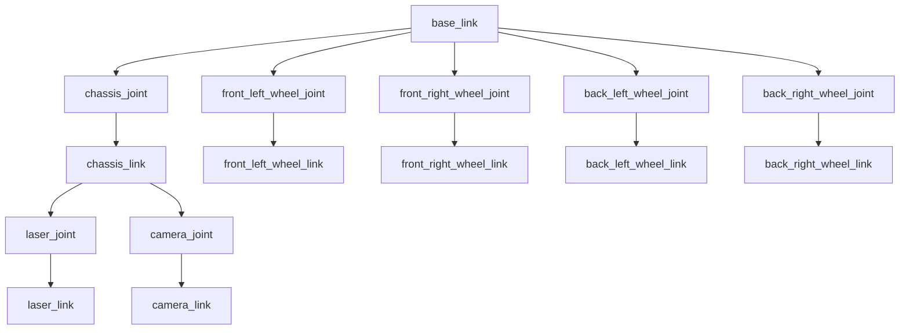
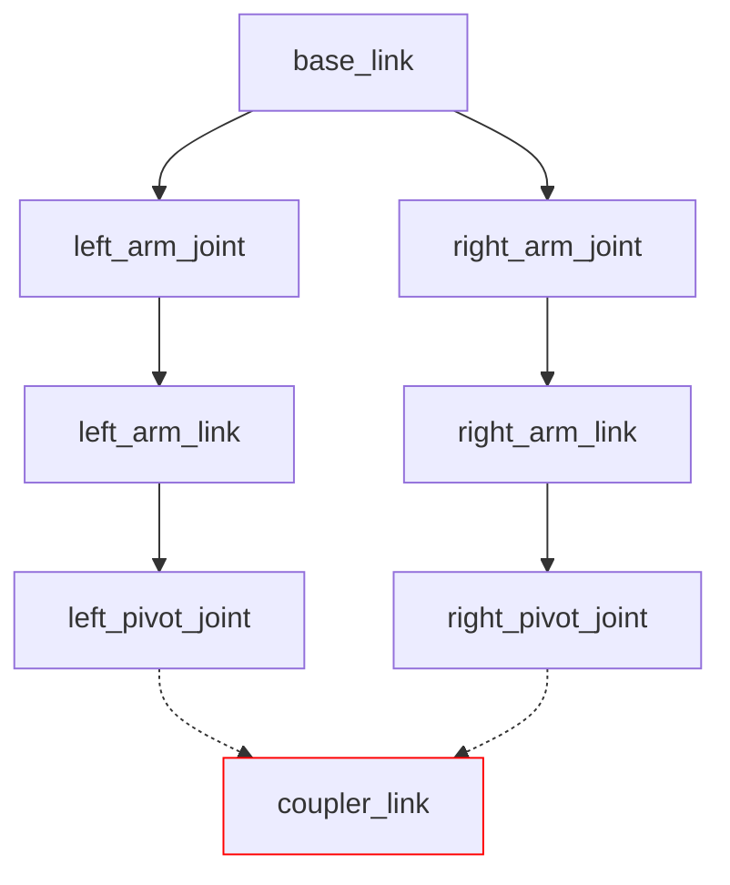

## Understanding URDF Files

Unified Robot Description Format (URDF) is the standard for representing a robot in ROS2. It serves as a machine-readable blueprint that allows ROS2 programs to "visualize" your robot in order to carry out its various tasks, such as control, sensing, and autonomy.

The purpose of this guide is to help you understand what a URDF represents, how they work, and how to get started with creating a basic URDF of a robot from scratch. As part of this process, this guide will spend a lot of time going over individual URDF tags and what they are used to represent. For a more detailed look at URDF standards and features, as well as guides on URDF integration for different libraries and softwares that work alongside ROS2, see our technical [URDF documentation](). Note that this documentation was written for ROS2 Jazzy, so if you are using a different version, there may be differences in structure.

The robot model you will construct in this guide is heavily based on a [video tutorial](https://www.youtube.com/watch?v=BcjHyhV0kIs&t=1292s) made by [Articulated Robotics](https://www.youtube.com/@ArticulatedRobotics) in 2022. While this is a fantastic guide and I strongly recommend watching it, the tutorial was made for ROS2 Foxy (EoL 2023), making it a little outdated. This guide will use a very similar model with some tweaks to the overall design to make it a little easier to understand, as well as bringing it in line with ROS2 Jazzy standards, as a few things have changed in the newer versions of ROS2 that can influence how your URDF is structured.

By the end of this guide, you should have a basic model of a robot in URDF format. If you visualize your URDF, either using a VSCode extension, running your ROS2 package with a launch file, or some other means, you should get a 3D model that looks something like this:

{: width="49%" }
{: width="49%" style="margin-left:1%;" }

> Note: I am using Foxglove Studio to render the URDF for this tutorial, if you are using something else, your model may look slightly different, but it should maintain the same core shapes.

## What is a URDF?

As previously stated, URDF, which stands for Unified Robot Description Format, is the standard for representing a robot's physical model through a ROS2 topic. When you launch your ROS2 package, the `/robot_description` topic publishes the information from your URDF and can be subscribed to and rendered by a visualizer like Rviz, Foxglove, or Rerun. These files effectively specify the size and shape of the robot, which is very helpful when it comes to things like remote navigation and autonomy.  

The URDF file is also used to specify the location of any cameras and sensors on the robot, which is a critical requirement for localization. If the robot does not know where sensor data is coming from relative to itself, it cannot use that data to orient itself or navigate autonomously.

## Structure of a URDF

URDF files are effectively highly specialized XML files. They define a series of elements that go on to define components of your robot, with each individual element defining a different "part" of the robot (i.e. wheels, chassis, a robotic arm, cameras, sensors, etc.). Each element has its own configurations, and its own specified placement in the final model. Each of these elements come together when ROS2 builds your URDF to define a complete model of your robot, either for the purposes of simulation in software such as Gazebo or MuJoCo, or for use in managing an actual robot.

All components of your robot specified in your URDF must follow a parent-child relationship. Basically, when you define a new element in your URDF, you need to specify what other part of the robot you "attach" it to. The URDF also treats the parent of a component as the origin for that component, so if you need to calculate coordinate displacement of a component, it needs to be done with reference to the component's parent. The only element in your URDF that is not a child of another component is the `base_link`. This is because the `base_link` is defined with the express purpose as acting as the parent to all other components in the URDF.

If you are struggling to visualize this concept, try thinking of it like a tree. The root of the tree is `base_link`, and every other part of the robot branches off from `base_link`.  



The tree visualization also helps clarify one of the most important (and limiting) rules about URDF: While a parent can have as many children as necessary, a child can have *only one* parent. This makes any closed loop system, such as a four-bar linkage or tank treads, impossible to accurately simulate with a URDF.

<!-- markdownlint-disable MD031 -->

{: .text-center }
<!-- markdownlint-enable MD031 -->

> This "tree" visualization of a four-point linkage shows how it's not possible for one child (`coupler_link`), to have multiple parents (`left_pivot_joint` and `right_pivot_joint`).

## Links and Joints

## Building your URDF

To get started with actually constructing your URDF, you must first do something very important. You need to give your robot a name! This name *must* be listed in the "main" URDF file. You can place it in our other files as well, but it is not necessary. For this tutorial, I named this robot "Tootles". The name is completely arbitrary. It doesn't matter what you choose, but you will want to keep it in mind for organizational purposes.  

While you can place all of your components into one large URDF file, this is generally not good practice, as they can get very large and difficult to manage relatively quickly. Instead, its a good idea to use Xacro (XML Macros) to split your URDF into multiple smaller files that can be compiled together using special tags. For a detailed look at how to integrate xacro into your URDF, see [URDF with xacro Templates](). For an extensive look at the additional features xacro provides, see [URDF with xacro Features]().

Now, to actually get started constructing the robot model, I like to first create the xacro files I will need, so that I can build the main URDF xacro. Every robot following this convention will have at least two xacro files. The first, `robotName.urdf.xacro` (replace `robotName` with the name you chose for your robot), will effectively serve as the location where you combine all of your xacro files together using `include` tags. You will also include your `base_link` in the main URDF file. The second file, `robotName_core.xacro`, is where you will define the core body of your robot. For our purposes, this will just consist of the robot's chassis, and the wheels, but for more complex robots, this file can easily grow quite large. If this is the case, you can further break up your core file into smaller xacro files, but this will not be necessary for this tutorial.  

Optionally, you can also include xacro files for various other aspects of your robot, or anything inside your ROS2 package that requires URDF components to function. If you want to simulate your robot in Gazebo, you will need to include SDF references in your URDF (see [Gazebo in URDF]()). If you want to integrate ros2_control into your robot, either for simulation or actual control, you will need URDF components for each of the joints you want to send or receive information from (see [ROS2 Control in URDF]()). Both of these should generally be done in their own xacro file, named `gazebo.xacro` and `ros2_control.xacro` respectively. For this project, I will be including one additional file, called `colors.xacro` that simply contains a few colors I can assign to different parts of the robot. Feel free to copy these for use in your own design, as I won't spend too much time going over them.  

```xml
<?xml version="1.0" encoding="utf-8"?>
<robot xmlns:xacro="http://www.ros.org/wiki/xacro">

  <!-- Colors for making different parts easier to identify -->
  <material name="red">
    <color rgba="1 0 0 1"/>
  </material>

  <material name="blue">
    <color rgba="0 0 1 1"/>
  </material>

  <material name="gray">
    <color rgba="0.6 0.6 0.6 1"/>
  </material>

  <material name="orange">
    <color rgba="1 0.5 0 1"/>
  </material>

</robot>
```

The `material` tag contains information about how a visualization software should make any given object look. The only tag within `material` you will have to worry about most of the time is `color`. The `color` tag takes in one string of four numbers, each within the range of 0 to 1. These numbers represent an RGBA value (Red, Green, Blue, Alpha). Alpha describes the transparency of the color.

Okay, now that we have made all of the files we will need, we can get started by building our main URDF file. These first couple of steps are also documented in [URDF with xacro Templates](#in-file-structure), but for the sake of simplicity I will explain these concepts again here. The first thing you need to do in every single xacro file is define the XML version and the UTF encoding you will be using. For URDF, you will always use XML Version 1.0 and UTF-9 encodings. Therefore, the first line on every single xacro you make should be:

```xml
<?xml version="1.0" encoding="utf-8"?>
```

Next, you need to declare the `robot` tag and import xacro, so that your system will recognize that we are using xacro syntax. The `robot` tag will contain *everything* else you write in the URDF. All of your xacro files need to have an enclosing `robot` tag. Remember, your main `robotName.urdf.xacro` file *must* declare the name of the robot. The rest of your xacro files will still need the `robot` tag and xacro import, but the inclusion of the name is completely optional.  

```xml
<robot xmlns:xacro="http://www.ros.org/wiki/xacro" name="Tootles">
    <!-- This is where the rest of your tags will be located -->
</robot>
```  

Now, with our basic structure in place, we will want to add the `include` tags that will allow our main URDF file to see everything. This is a fairly simple process. For each additional xacro file in your `urdf` directory, you will want to add a new line like this:

```xml
<!-- Replace "file_name.xacro" with whatever file you want to include. -->
<xacro:include filename="file_name.xacro"/>
```  

Once you have included all of your xacro files, you will now want to declare your `base_link`. This is basically an invisible point on the URDF that serves as the parent of the entire robot. All other parts of the robot are either children of the base link, either directly or indirectly.  