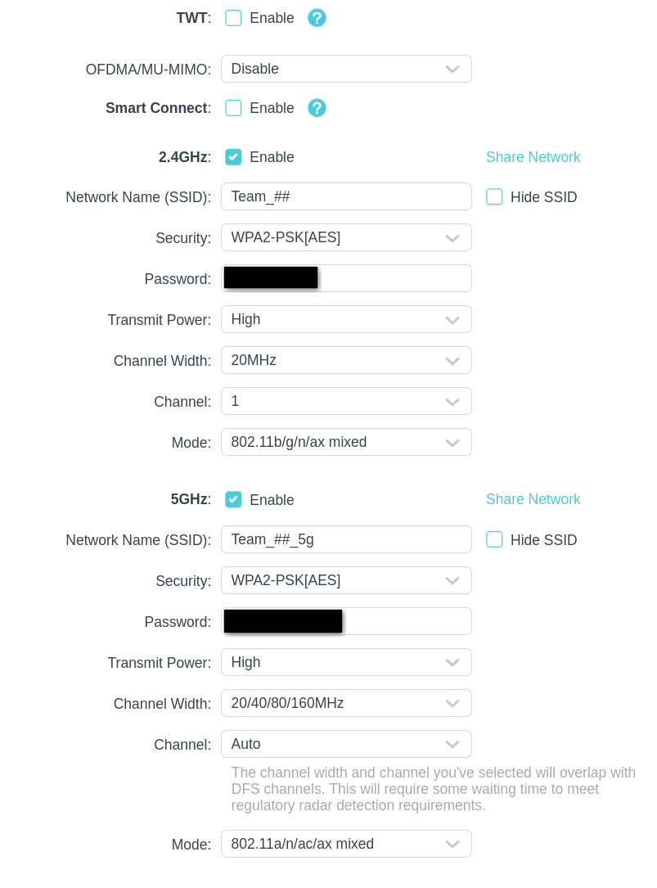

## Router Setup

This guide was written for the [tp-link Archer AX80](https://www.tp-link.com/us/home-networking/wifi-router/archer-ax80/) router.

If you need to factory reset the router (which happens kind of often), get a paperclip and insert it into the pinhole labelled Reset on the back of the router. Hold it for ~5-10 seconds and the light on the router should start blinking blue. The router will take a few minutes to boot up again, and in this time it will be slow blinking orange/yellow. It is ready to connect to when the light is solid red.

In order to edit the router, you have to connect to its network and go to its dashboard site. **The default network name and password are printed in several locations on the labels on the bottom of the router.** If you have recently factory reset the router, this is the password and network information you need to connect to the router. Otherwise, the specific network and password will be stored in more private documents. Connect to this network, input the password, and go to http://tplinkwifi.net to configure the wifi. **WHEN CONFIGURING THE ROUTER FOR THE FIRST TIME, DISABLE SMART CONNECT IT VIOLATES A LOT OF NASA RULES.**

**Regular setup guides and even the dashboard will be complaining constantly or be contradictory because we are not using this router for it's usual purpose.** Most setup guides call for connecting the router to ethernet or a modem. You can ignore these steps.

Ensure the router is configured to the specifications of [WiFi Requirements](). The recommended settings (Advanced -> Wireless -> Wireless Settings) are below (in addition to smart connect being off):

## Setting up SSH Connection

**Tailscale does not work over the router.** You will have to SSH in the regular not fancy way. Remember you can find the IP of the Mini PC through `ip a`, locating the one that starts with w, and looking for the inet connection IP.

1. Ensure that SSH is installed (it does not come pre-installed on Ubuntu fun fact). `sudo apt install openssh-server`.
2. Ensure the SSH server is running with `sudo systemctl status ssh`.
3. You can SSH into this machine with `ssh <username>@<ip>.
4. You can find the IP by doing `ip a` and finding either the wlp3s0, wlan, wlp, wlp2s0, or similar connection and looking at the inet address. **Note that the IP address of the computer while connected to the router and while connected to eduroam or something will be different.**
5. The username will just be the username you see when running commands in the terminal. Terminal commands follow the format `<user>@<computername>:~$`.

## Router Use During Competition

1. Plug the router into power.
2. Ensure the WiFi Antenna is attached to the Mini PC.
3. SSH into the Mini PC to ensure the connection is properly established.

> Author: Ella Moody (<https://github.com/TheThingKnownAsKit>)
