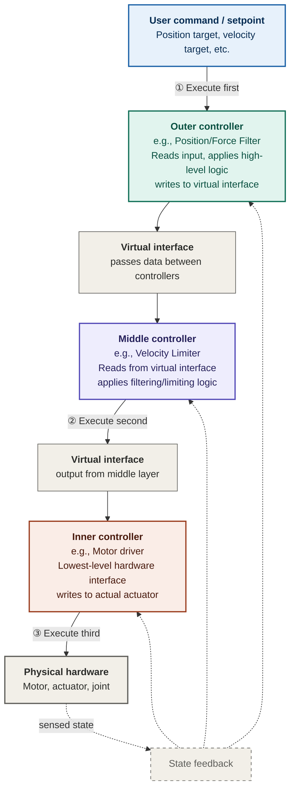

## Chained Controllers

Chained controllers are neat a feature in `ros2_control` with terrible documentation that allows for the creation of *hierarchial compositions of controller*; this means that one controller's output can become another controllers input. This allows you to do some cool things such as stacking simple, reusable controllers together for better code readability and additionally allow you to interchange controllers to change how the robot behaves under certain conditions.

### Architecture Overview

In a chained controller setup:
  1. **Input Controller** (or "inner controller") receives commands and produces outputs
  2. **Output Controller** (or "outer controller") consumes those outputs as inputs
  3. The physical hardware interface receives the final command from the outermost controller

### Execution Flow Explanation

#### 1. Data Pipeline
Each chained controller layer forms a *data transformation pipeline*:
- **Input**: Receives commands from the previous layer (or user input for outermost)
- **Process**: Applies control logic (filtering, limiting, conversion, etc.)
- **Output**: Writes transformed command to a *virtual interface*
- **Next layer**: Reads from that virtual interface as its input

#### 2. Synchronous Execution Order
The controller manager executes all controllers in *one control cycle* at a fixed frequency:
1. **Outer controller executes first** → reads user input → writes to virtual interface
2. **Middle controller executes** → reads virtual interface → applies logic → writes to next virtual interface
3. **Inner controller executes** → reads virtual interface → writes to hardware

This deterministic ordering is critical—inner controllers see the output of outer controllers within the same cycle.

#### 3. Virtual Interfaces as Connection Points
Virtual interfaces are the **glue** that enables chaining:
- Not physical hardware connections
- In-memory data structures managed by the controller manager
- Allow decoupling of controllers while maintaining synchronous execution
- One controller's output interface becomes another's input interface

#### 4. State Feedback
All controllers read *sensed state* from the hardware during each cycle:
- Position, velocity, current, force, etc.
- Available to all layers simultaneously
- Enables feedback control at each level



---

### Advantages and Disadvantages of Chained Controllers

#### Advantages

| Pro | Impact | Example |
|-----|--------|---------|
| **Modularity** | Write once, use in many systems | A velocity limiter works on any robot with velocity interface |
| **Testability** | Test each layer independently | Validate force limiter without tuning PID gains |
| **Reusability** | Swap layers without modifying others | Use same rate limiter on 5 different robots |
| **Debugging** | Isolate which layer is misbehaving | Print values at each virtual interface to find the issue |
| **Safety** | Safety constraints live in a dedicated layer | Force limiter can be proven separately |
| **Clarity** | Each controller has one clear job | Reader understands "this PID controls velocity, period" |
| **Incremental development** | Build and test bottom-up | Get motor working, add velocity loop, add position loop |
| **Documentation** | Each interface is explicit | Data flowing between layers is visible and named |
| **Cascaded tuning** | Use proven methods (e.g., cascade control) | Inner loops faster, outer loops slower |

---

#### Disadvantages

| Con | Impact | When It Bites |
|-----|--------|---------------|
| **Computational overhead** | Each layer needs update, copy, allocation | Very high-frequency systems (>10 kHz) with many layers |
| **Latency** | Each virtual interface copy adds 1 cycle delay | < 1ms control loops with >3 chained layers |
| **Debugging complexity** | Need to trace data through multiple stages | 5+ layer chains become hard to reason about |
| **Tuning difficulty** | Must tune each layer considering others | Cascaded PIDs with poor initial gains can be unstable |
| **Memory overhead** | Virtual interfaces consume RAM | Embedded systems with limited memory |
| **Coupling** | Bad tuning at one layer can break others | Inner loop gains too high → oscillations propagate outward |
| **Interface mismatch errors** | Wrong interface names = silent failures | Easy to misconfig `chained_from` parameter |
| **Synchronization burden** | All layers must execute in one cycle | If one layer is slow, entire chain is bottlenecked |
| **Harder to optimize** | Can't fuse operations across layers | Could be more efficient with a monolithic controller |


### Should You Use Chained Controllers?

#### Use Chained Controllers If...

- [ ] You have **2-4+ functional layers** that benefit from separation
- [ ] Each layer has a **clear, independent responsibility**
- [ ] You want **independent testability** of each stage
- [ ] **Safety constraints** need to be isolated and proven
- [ ] You plan to **reuse some controllers** across projects
- [ ] Your update rate is **≤ 500 Hz** (allows some latency per layer)
- [ ] You need **clear data flow** for documentation/certification
- [ ] You're using **cascaded control** (position→velocity→current)
- [ ] You have **multiple independent filters/limiters** to apply
- [ ] Team members need to work on **different control layers** independently

#### Avoid Chained Controllers If...

- [ ] Your system has **only 1-2 control stages** total
- [ ] Everything **tightly couples together** (can't separate concerns)
- [ ] You need **sub-millisecond latency** (< 1 ms cycle time)
- [ ] Running at **very high frequency** (> 5 kHz) with limited CPU
- [ ] You're **optimizing for absolute performance** (every nanosecond counts)
- [ ] The system is **simple enough for one monolithic controller**
- [ ] You have **severe memory constraints** (embedded microcontroller)
- [ ] Data flow is **inherently non-linear** (hard to linearize into layers)
- [ ] You're doing **real-time critical tasks** where extra copying adds jitter
- [ ] **No reuse expected**—this is a one-off, project-specific system

### Real-World Examples

#### 1. **Collaborative Manipulator Arm**
A robot that interacts safely with humans needs multiple control layers:

```
User pose command
    ↓
Inverse kinematics controller (6D pose → 7 joint angles)
    ↓ (virtual interface)
Position trajectory generator (smooth path planning)
    ↓ (virtual interface)
Joint impedance controller (compliance + stability)
    ↓ (virtual interface)
Force limiter (safety: max 150 N)
    ↓ (virtual interface)
Motor current controller (low-level motor commands)
    ↓
Joint actuators
```

**Why chained controllers shine here:**
- Each layer is independently tunable and testable
- Can swap out the force limiter without touching other layers
- Clear separation of concerns (kinematics, path planning, impedance, safety)
- Easy to debug each stage independently

---

#### 2. **Autonomous Mobile Robot with Velocity Constraints**
Ground robot with multiple velocity-limiting stages:

```
Global navigation command (target velocity 2.0 m/s)
    ↓
Velocity filter / trajectory smoother (smooth transitions)
    ↓ (virtual interface)
Rate limiter (max accel 0.5 m/s²)
    ↓ (virtual interface)
Safety velocity governor (terrain-aware speed cap)
    ↓ (virtual interface)
Motor velocity controller (sends voltage to wheels)
    ↓
Drive motors
```

**Why it works:**
- Different safety constraints can be layered independently
- Navigation layer doesn't need to know about motor driver details
- Each controller handles one aspect of motion safety

---

#### 3. **Industrial Conveyor Belt System**
Multiple speed profiles and safety interlocks:

```
Production line speed setpoint
    ↓
Production mode selector (normal / fast / slow)
    ↓ (virtual interface)
Emergency stop enforcer (kill-switch override)
    ↓ (virtual interface)
Thermal throttle (reduce speed if motor overheats)
    ↓ (virtual interface)
Load balancer (distribute to multiple motors)
    ↓ (virtual interface)
Motor speed controller (PWM to each motor)
    ↓
Motors
```

**Why chained controllers excel:**
- Safety layers are isolated and can't interfere with each other
- Easy to add/remove safety constraints without rebuilding
- Each constraint is independently verifiable
- Perfect for industrial safety certifications

---

#### 4. **Drone with Nested PID Control**
Classic cascaded control architecture:

```
User desired altitude
    ↓
Altitude PID (converts altitude error → vertical velocity setpoint)
    ↓ (virtual interface)
Vertical velocity PID (converts vel error → thrust command)
    ↓ (virtual interface)
Motor mixer & voltage driver (convert thrust → 4 motor commands)
    ↓
ESCs → Motors
```

**Why this is the standard:**
- Well-established cascade tuning methodology
- Inner loop (velocity) reacts faster than outer loop (position)
- Each PID layer has different gains for its speed scale
- Proven to be stable across many drone platforms

---

#### 5. **Surgical Robot with Force Feedback**
Haptic master-slave teleoperation:

```
Surgeon hand position (from force feedback device)
    ↓
Master impedance model (apply virtual compliance feel)
    ↓ (virtual interface)
Teleoperation filter (reduce noise from jitter)
    ↓ (virtual interface)
Slave impedance controller (compliance at instrument tip)
    ↓ (virtual interface)
Force limiter (safety: max cutting force 5 N)
    ↓ (virtual interface)
Slave motor controller (send commands to robot arm)
    ↓
Surgical instrument actuators
```

**Why essential here:**
- Each stability/safety layer can be proven independently
- Easier to validate for medical device certification
- Surgeon feels consistent haptic feedback regardless of complexity below
- Force limits are explicitly enforced at a specific layer
